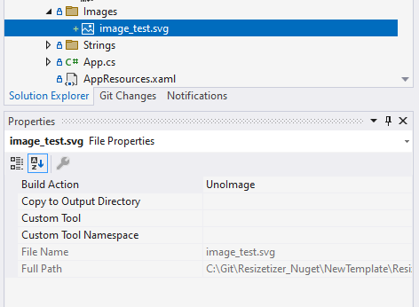
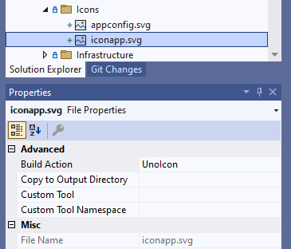
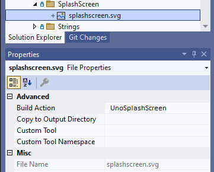

# How-To: Get Started with Uno.Resizetizer

Uno.Resizetizer is a set of MSBuild tasks designed to manage an application's assets. With this package, there's no need to worry about creating and maintaining various image sizes or setting up a splash screen. Simply, provide an SVG file, and the tool will handle everything else.

As of Uno Platform 4.8, the Uno.Resizetizer package is now included in the solution template by default. However, if you're working with an application created in a previous version of Uno Platform, you can still utilize the package by following the steps outlined below.

> [!TIP]
> To create an app, make sure to visit [our getting started tutorials](xref:Uno.GetStarted).

## How it works

Resizetizer uses an `svg` or `png` file as input. If an `svg` file is used, it will be re-scaled for different resolutions. The `UnoImage`, on iOS, for example, will use the x2 and x3 corresponding sizes and add them to your project for you. If a `png` file is used, it will not be resized, but it will be added to your project and used as one size image. If you want to know all the scales that are used, you can check this [Table of scales](https://platform.uno/docs/articles/features/working-with-assets.html#table-of-scales).

For `UnoIcon` and `UnoSplashScreen`, the generated sizes will be the same as the ones used by the platform.

As `svg` has the ability to scale without losing quality, we strongly encourage the usage of `svg` files, to take most of the benefits of the tool. In the rest of the docs, you can assume that we are using `svg` files.

> [!TIP]
> You can use the `Resize` property on `UnoImage` to force the resize of a `png` file. But be aware that the quality can be affected.

## Manual Installation

Uno.Resizeter is delivered [through NuGet](https://www.nuget.org/packages/Uno.Resizetizer). In order to install it, you can either install it in your project using your IDE (this will be shown in the next steps) or added directly on your `.csproj` as shown in the [NuGet page](https://www.nuget.org/packages/Uno.Resizetizer/).

> [!NOTE]
> If you're using the new template, you can skip this step because it is already included by default with Uno Platform 4.8 and later.
  
### 1. Installing Uno.Resizetizer

* Open your favorite IDE, in this case, it will be Visual Studio, after that open the Manage NuGet packages window.
* Search for `Uno.Resizetizer` and install it over your projects.

> [!NOTE]
> Uno.Resizetizer is compatible with projects running .NET 6 and later.

## Usage

Uno.Resizetizer can handle:

* Images used in the application
* The App icon
* The splash screen

The next sections will show how to use it for each use case.

> [!WARNING]
> All the assets used by Uno.Resizetizer should be lower case and don't have special characters. You can use `_` to separate words.
> This is because the assets are used on different platforms and some of them have limitations on the characters that can be used.

### UnoImage

`UnoImage` is the build action used for images that will be part of the app.

### 2. Configure the project to use generated Images

* In the App Class library, create a folder called `Assets` (if doesn't exist) and then create a folder called `Images`. We now need to add assets to this folder.

> [!TIP]
> Those folder names are examples. It is possible to create folders with any name and how many levels are needed.

Make sure that the build assets are configured to be `UnoImage`. In the `csproj`, to make all files inside the `Assets\Images` folder to be automatically configured to be `UnoImage`, add the following:

```xml
<ItemGroup>
    <UnoImage Include="Assets\Images\*" />
</ItemGroup>
```

You can also make specific files to be `UnoImage` using Visual Studio, by right-clicking on the file, selecting `Properties`, then `Build Action`, and selecting `UnoImage`. The image below shows what it looks like:



### 3. Using the assets on the project

* `UnoImage` assets can now be used just like any regular image. For example:

```xml
<Image Width="300"
       Height="300"
       Source="Assets/Images/my_image.png" />
```

> [!TIP]
> Make sure to add the `.png` at the end of the file name

## UnoIcon

`UnoIcon` is the build action for the app icon. There should only be one per application. The `UnoIcon` accepts two assets, one that represents the `Foreground` and another that represents the `Background`. During the generation phase, those files will be merged into one `.png` image.

During the creation of your `svg` file, please remember to make the `ViewBox` bigger than the `Foreground` and `Background` images, not adding an extra space could cause the app icon to not look good on some platforms. We recommend to add a 30% extra space on each side. This will be enough for Resizetizer to work with padding and margins.

### 4. Configuring the project to use generated app icon

# [**Class Library Based Solution**](#tab/classlib)

* Create an `Icons` folder inside the Base project, and add the files related to the app icon there.
* Now open the `base.props` file, inside the `MyApp.Base` folder project and add the following block:

```xml
<ItemGroup>
    <UnoIcon Include="$(MSBuildThisFileDirectory)Icons\iconapp.svg"
             ForegroundFile="$(MSBuildThisFileDirectory)Icons\appconfig.svg"
             Color="#FF0000"/>
</ItemGroup>
```

We recommend adding the `UnoIcon` on `base.props` because this file is imported by all head projects, that way, you don't need to add the same configuration in each head project.

If you want, you can see our sample project in [Uno.Resizetizer GitHub repository](https://github.com/unoplatform/uno.resizetizer/blob/7ad1199ea1a256e171d88e694486e9a8c341c8a2/samples/NewTemplate/Resizetizer.Extensions.Sample.Base/base.props#L13-L16) where this step is configured.

> [!TIP]
> If the icon doesn't look good, you can use the `ForegroundScale` property which will re-scale the `Foreground` image for all platforms. If you want to re-scale for a specific platform, you can use the specific property for that platform. For more information, see [Resizetizer Properties](xref:Overview.Uno.Resizetizer.Properties).

# [**Shared Project Based Solution**](#tab/sharedproject)

* Create an `Icons` folder inside the Shared project, and add the files related to the app icon there.
* In each of your project heads (iOS, Android, WebAssembly, ...), add the following block to the `csproj` file:

```xml
<ItemGroup>
    <UnoIcon Include="..\MyApp.Shared\Icons\iconapp.svg"
             ForegroundFile="..\MyApp.Shared\Icons\appconfig.svg"
             Color="#FF0000"/>
</ItemGroup>
```

You can also make specific files to be `UnoIcon` using Visual Studio, by right-clicking on the file, selecting `Properties`, then `Build Action`, and selecting `UnoIcon`. The image below shows what it looks like:



-----

Next, some adjustments are needed on `Android`, `Windows (WinUI)`, `WebAssembly`, `mac-catalyst`, and `iOS`.

# [**Android**](#tab/Android)

* Open the [`Main.Android.cs` file](https://github.com/unoplatform/uno.resizetizer/blob/main/samples/NewTemplate/Resizetizer.Extensions.Sample.Mobile/Android/Main.Android.cs) (or the file that has the `Android.App.ApplicationAttribute`), and change the `Icon` property, in that attribute, to be the name of the file used in the `Include` property of `UnoIcon`, in our case will be:

  ```csharp
  [global::Android.App.ApplicationAttribute(
      Label = "@string/ApplicationName",
      Icon = "@mipmap/iconapp",
      //...
  )]
  ```

> [!TIP]
> You can remove the old assets related to the app icon from the `Android` project.

# [**Windows (WinUI)**](#tab/Windows)

> [!NOTE]
> Uno.Resizetizer is currently only supported on WinUI, UWP is not supported."

* Open the [`Package.appxmanifest` file](https://github.com/unoplatform/uno.resizetizer/blob/main/samples/NewTemplate/Resizetizer.Extensions.Sample.Windows/Package.appxmanifest) and look for the `Application` tag
* Remove everything that's related to the application icon (BackgroundColor, Square and Wide property inside the `uap:DefaultTile` attribute). It should look like this:

    ```xml
    <Applications>
       <Application Id="App"
         Executable="$targetnametoken$.exe"
         EntryPoint="$targetentrypoint$">
         <uap:VisualElements
           DisplayName="Resizetizer.Extensions.Sample"
           Description="Resizetizer.Extensions.Sample">
           <uap:SplashScreen Image="Resizetizer.Extensions.Sample/Assets/SplashScreen.png" />
           <uap:DefaultTile/>
         </uap:VisualElements>
       </Application>
     </Applications>
    ```

# [**Web Assembly (Wasm)**](#tab/Wasm)

> [!NOTE]
> You will only need to configure this platform if you want to deploy it as a PWA.

* Open the [`manifest.webmanifest` file](https://github.com/unoplatform/uno.resizetizer/blob/main/samples/NewTemplate/Resizetizer.Extensions.Sample.Wasm/manifest.json) and look for the `icons` tag and remove all the values inside it. You should be seeing an empty array like this:

    ```json
    {
      "background_color": "#ffffff",
      "description": "UnoResApp1",
      "display": "standalone",
      "icons": [ ],
    }
    ```

> [!NOTE]
> In some projects, the file is named `manifest.json` instead of `manifest.webmanifest`. If so, you can either adjust your project to use `manifest.webmanifest` or keep it as `manifest.json`.
>
> [!NOTE]
> Uno.Resizetizer will support comments on your json file, but they will be ignored on the final generated file.

# [**iOS**](#tab/iOS)

* For `mac-catalyst` and `iOS`, open the [`info.plist` file](https://github.com/unoplatform/uno.resizetizer/blob/main/samples/NewTemplate/Resizetizer.Extensions.Sample.Mobile/iOS/Info.plist), find the `XSAppIconAsset` key, and change its value to `Assets.xcassets/iconapp.appiconset`.

> [!NOTE]
> If your app icon has a another name than `iconapp`, use it instead.
>
> [!TIP]
> You can delete the old assets related to the app icon from the project.

-----

## UnoSplashScreen

`UnoSplashScreen` is the build action for the splash screen. There should only be one per application. The `UnoSplashScreen` has two more properties that you can use to adjust your asset, which are:

* `BaseSize`: It's the size that will be used to perform the scaling of the image. The default value is the size of the asset. So, if you feel that your SplashScreen doesn't look right, you can tweak this value.

* `Color`: It's the background color that will be used to fill the empty space on the final SplashScreen asset. The default value is `#FFFFFF` (white).

### 5. Configuring the project to use generated splash screen

# [**Class Library Based Solution**](#tab/classlib)

* Create a `SplashScreen` folder inside the Base project, and add the file related to the splash screen there.
* Now, open the `base.props` file inside the `MyApp.Base` folder project and add the following block:

    ```xml
    <UnoSplashScreen
             Include="$(MSBuildThisFileDirectory)SplashScreen\splash_screen.svg"
             BaseSize="128,128"
             Color="#512BD4" />
    ```

We recommend adding the `UnoSplashScreen` on `base.props` because this file is imported by all head projects, that way, you don't need to add the same configuration on each head project.

If you want, you can see our sample project in [Uno.Resizetizer GitHub repository](https://github.com/unoplatform/uno.resizetizer/blob/7ad1199ea1a256e171d88e694486e9a8c341c8a2/samples/NewTemplate/Resizetizer.Extensions.Sample.Base/base.props#L17-L21).

# [**Shared Project Based Solution**](#tab/sharedproject)

* Create a `SplashScreen` folder inside the Shared project, and add the file related to the splash screen there.
* In each of your project heads (iOS, Android, WebAssembly, ...), add the following block to the `csproj` file:

    ```xml
    <UnoSplashScreen
             Include="..\MyApp.Shared\SplashScreen\splash_screen.svg"
             BaseSize="128,128"
             Color="#512BD4" />
    ```

You can also make specific files to be `UnoSplashScreen` using Visual Studio, by right-clicking on the file, selecting `Properties`, then `Build Action`, and selecting `UnoSplashScreen`. The image below shows what it looks like:



***

Next, some adjustments are needed on `Android`, `Windows`, and `iOS`.

# [**Android**](#tab/Android)

* Open the [`style.xml` file](https://github.com/unoplatform/uno.resizetizer/blob/main/samples/NewTemplate/Resizetizer.Extensions.Sample.Mobile/Android/Resources/values/Styles.xml), look for the `Theme` that is been used by the application and add the following line:

    ```xml
    <style name="AppTheme" parent="Theme.AppCompat.Light">
    
        <!-- Other properties -->
    
        <!-- This property is used for the splash screen -->
        <item name="android:windowSplashScreenBackground">@color/uno_splash_color</item>
        <item name="android:windowBackground">@drawable/uno_splash_image</item>
        <item name="android:windowSplashScreenAnimatedIcon">@drawable/uno_splash_image</item>
    
        <!-- Image at the footer -->
        <!-- This is not required in order to make the Splash screen work -->
        <!-- For more info please see: https://developer.android.com/develop/ui/views/launch/splash-screen#set-theme -->
        <item name="android:windowSplashScreenBrandingImage">@drawable/uno_splash_image</item>
    </style>
    ```

> [!NOTE]
> The `uno_splash_image` and `uno_splash_color` are generated by the build process.

# [**Windows (WinUI)**](#tab/Windows)

* Open the [`Package.appxmanifest` file](https://github.com/unoplatform/uno.resizetizer/blob/main/samples/NewTemplate/Resizetizer.Extensions.Sample.Windows/Package.appxmanifest) and look for the `Application` node, inside it, look for the `uap:SplashScreen` node. Delete the `Image` property and its value, the `Application` tag should be like this:

    ```xml
    <Applications>
       <Application Id="App"
         Executable="$targetnametoken$.exe"
         EntryPoint="$targetentrypoint$">
         <uap:VisualElements
           DisplayName="Resizetizer.Extensions.Sample"
           Description="Resizetizer.Extensions.Sample">
           <uap:SplashScreen />
           <uap:DefaultTile />
         </uap:VisualElements>
       </Application>
     </Applications>
    ```

# [**Web Assembly (Wasm)**](#tab/Wasm)

* No additional adjustments are needed on Wasm.

# [**iOS**](#tab/iOS)

* Open the [`info.plist` file](https://github.com/unoplatform/uno.resizetizer/blob/main/samples/NewTemplate/Resizetizer.Extensions.Sample.Mobile/iOS/Info.plist) and look for the `UILaunchStoryboardName` key, delete it and its value.

> [!TIP]
> Feel free to delete the `LaunchScreen.storyboard` file.

> [!NOTE]
> Feel free to delete old assets related to the splash screen.

-----

## Sample App Example

A sample app is available [here](https://github.com/unoplatform/uno.resizetizer/tree/main/samples/NewTemplate) as an example for all the previous steps detailed above.

## Troubleshooting

### Windows (WinUI)

In some cases, the OS caches the app icon and your changes might not be applied. To fix this issue, first uninstall your app and then use one of the following options:

1. In the run dialog (Win + R) execute `ie4uinit.exe -ClearIconCache`
2. Restart `explorer.exe` process (in **Task Manager - Details** select `explorer.exe` in the list and click on **Restart task**).
3. Reboot your PC

Afterward, try to deploy the app again and your icons should be updated correctly.